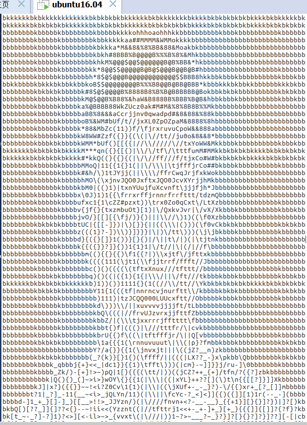

# 图片转为字符画

##效果图

##流程图

##使用到的模块
###1. PIL之Image

文档:http://pythonware.com/products/pil/

Image 模块提供了一个同名类（Image），也提供了一些工厂函数，包括从文件中载入图片和创建新图片。

###2. argaprse

官方文档:[http://docs.python.org/2/howto/argparse.html#id1](http://docs.python.org/2/howto/argparse.html#id1)

argparse是python用于解析命令行参数和选项的标准模块，用于代替已经过时的optparse模块。argparse模块的作用是用于解析命令行参数，例如python chars py input.txt output.txt 80

参考资料: 实验楼